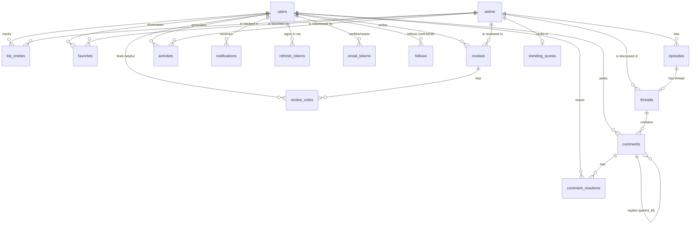

# Data model

PostgreSQL is the source of truth; Redis holds only rebuildable artifacts
(caches, rate-limit counters, the trending ZSET, job queue). Migrations live
in [`backend/migrations`](../backend/migrations) (embedded, run on startup);
every query is defined in [`backend/queries`](../backend/queries) and
compiled by sqlc.

## ERD

## Tables

### Identity & auth
- **users** — `email` and `username` are `citext` uniques; `password_hash`
  is nullable (Discord-only accounts) with a CHECK that *some* credential
  exists; `role` enum (`user|mod|admin`); profile fields (bio, avatar_url,
  favorite_genres[]).
- **refresh_tokens** — sha256 digests only, grouped by `family_id` (one
  family per login/device). Rotation marks the old row `used_at`; presenting
  a used token revokes the family (theft response). `revoked_at` supports
  logout and mass revocation on password reset.
- **email_tokens** — single-use (`used_at`), purpose-scoped
  (`verify_email|reset_password`), hashed, expiring.

### Catalog (mirrored from AniList)
- **anime** — `anilist_id` unique makes every sync an idempotent upsert.
  Titles ×3 + synonyms[], genres[], tags/studios as JSONB, cover/banner,
  upstream stats (`average_score` 0-100, `popularity`, `anilist_trending`),
  `next_airing_*`, `synced_at`. `search_doc` is a **generated tsvector**
  (romaji/english weighted A, synonyms B, genres C — `simple` config since
  titles are proper nouns) with a GIN index, plus trigram GIN indexes on
  both titles for typo tolerance.
- **episodes** — `(anime_id, number)` unique; `airing_at` filled by the
  airing-schedule sync; rows pre-created for counted shows so every episode
  can anchor a thread.

### Tracking (the MAL core)
- **list_entries** — `(user_id, anime_id)` unique; `status` enum
  (`watching|completed|planning|paused|dropped`), `score` 1-10 CHECK,
  `progress`, `started_on`/`finished_on`. State transitions (auto-complete
  at final episode, date stamping) are service logic, unit-tested.
- **favorites** — plain M2M with `created_at`; doubles as taste signal.

### Community
- **reviews** — `(user_id, anime_id)` unique, body 100–20 000 chars CHECK,
  spoiler flag, denormalized `helpful_count` (adjusted transactionally with
  **review_votes** rows), soft-delete.
- **threads** — `kind` enum (`series|episode`) with partial unique indexes
  (one series board per anime, one thread per episode) and a CHECK tying
  `episode_id` to the kind. Denormalized `comment_count` /
  `last_activity_at` bumped transactionally.
- **comments** — adjacency list (`parent_id`), `timestamp_seconds` nullable
  (episode threads only, enforced in the service), spoiler flag,
  soft-delete (tombstones keep tree shape).
- **comment_reactions** — PK `(comment_id, user_id, emoji)`, emoji CHECK'd
  against a fixed vocabulary.
- **follows** — PK `(follower_id, followee_id)`, self-follow CHECK.

### Event spine
- **activities** — append-only: `(user_id, type, anime_id, ref_id,
  payload jsonb, created_at)`. Written in the **same transaction** as the
  action it records. Read by two consumers: the follow feed (keyset on
  `(user_id, id DESC)`) and the trending recompute (window scan on
  `created_at`). One stream, two products.
- **notifications** — materialized per recipient by asynq workers
  (`comment_reply|new_follower|episode_aired`), `read_at`, payload carries
  deep-link data. Partial index on unread.
- **trending_scores** — durable snapshot of the latest ranking (the serve
  path is a Redis ZSET; this table is for durability and debugging).

### Moderation
- **reports** (slice 10) — polymorphic `(subject_type, subject_id)`,
  reporter, reason, status. Soft-deletes everywhere user content lives.

## Conventions

- `BIGINT GENERATED ALWAYS AS IDENTITY` PKs throughout.
- `TIMESTAMPTZ` everywhere; `updated_at` maintained by a shared trigger.
- Enums are Postgres enums (sqlc turns them into Go constants — invalid
  states don't compile).
- Soft deletes (`deleted_at`) for user content; hard deletes only via
  account cascade.
- Every FK that must cascade does so explicitly (`ON DELETE CASCADE`).
